# MusicSpot Music Landing Page

A modern, responsive landing page for **MusicSpot**, built using pure HTML, CSS, and Bootstrap. This project features a clean, lightweight UI designed for speed and a smooth user experience.

---

## Features

- **Ad-Free Experience**
- **Lightweight UI**
- **Bulk Download**
- **Lightning Fast**
- **Safe & Secure**
- **High Quality**

---

## Wireframes

## 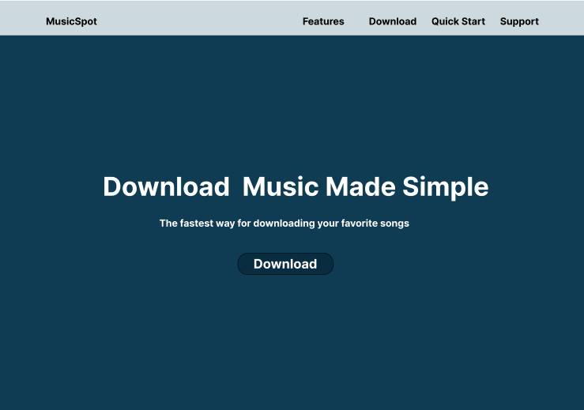

## Color Palette

- **Primary Gradient:** #082d41, #2a7299
- **Text:** #212529

---

## Technologies Used

- **HTML5:** Semantic markup
- **CSS3:** Flexbox, Grid
- **Font Awesome:** Social media icons
- **Bootstrap** — Layout Utilities

---

## Live link:

- **GitHub Pages:** https://deva-p-stack.github.io/cyberdude-task/index.html
- **Netlify:** https://musicspot-official.netlify.app/

---

## Final Output

**Desktop View**

## 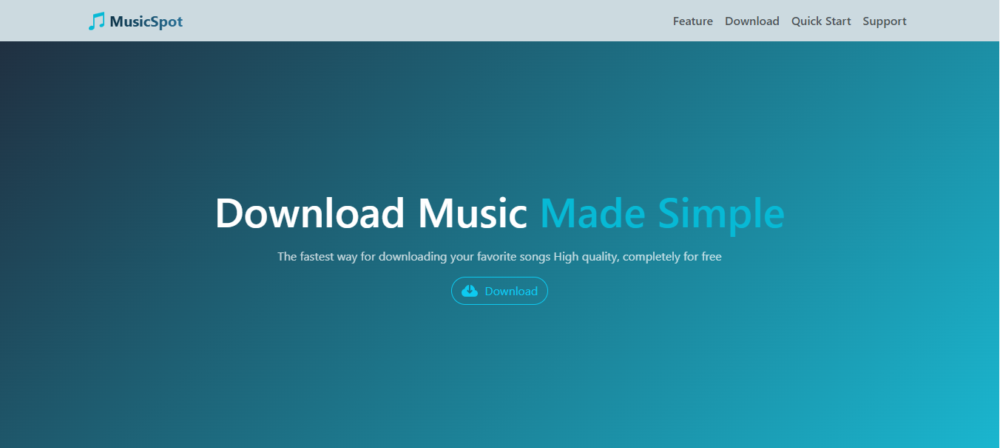

## 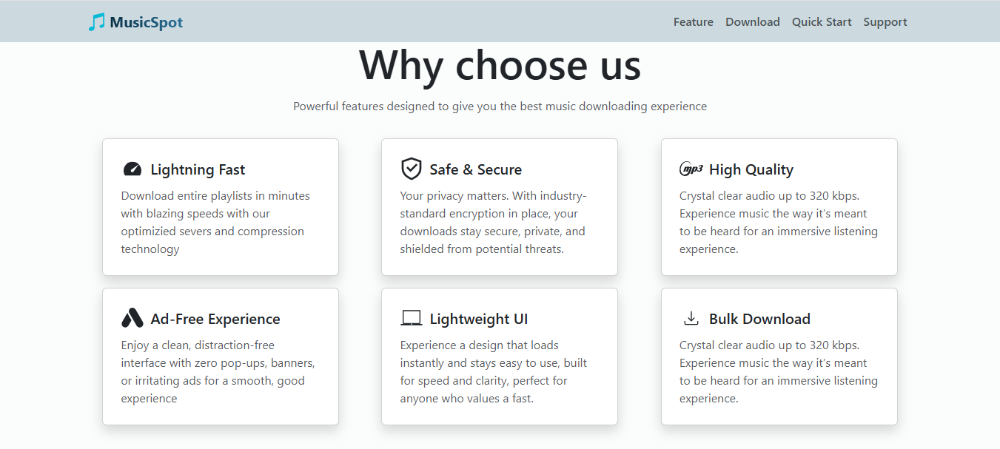

## 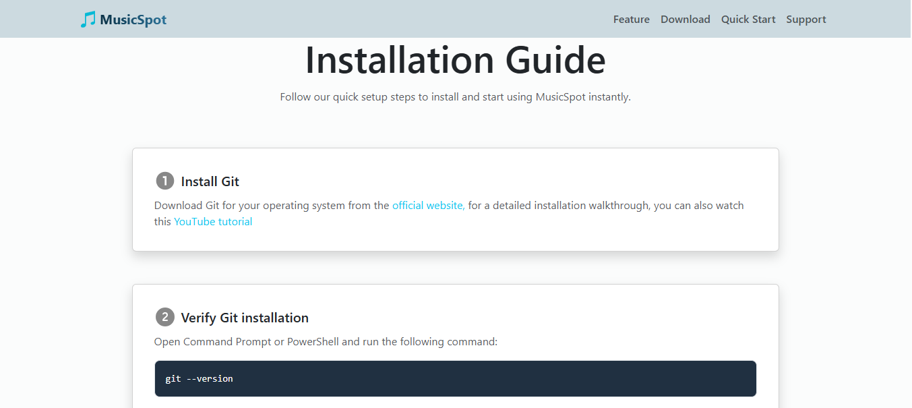

## 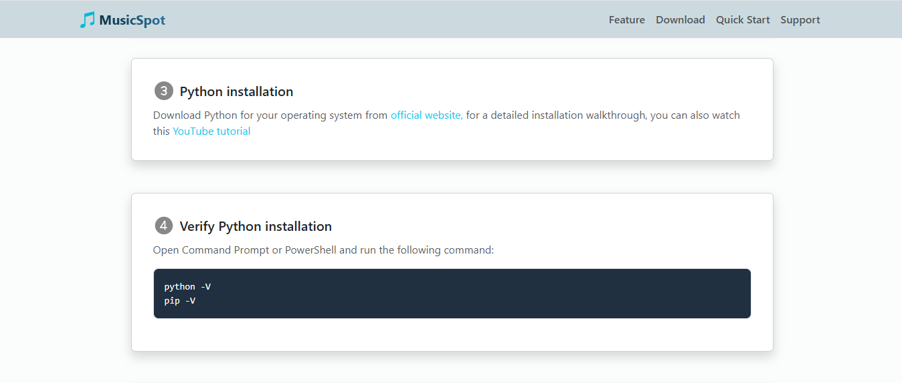

## 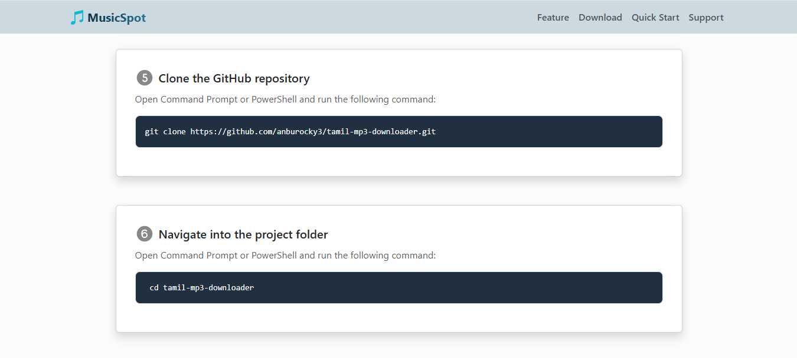

## 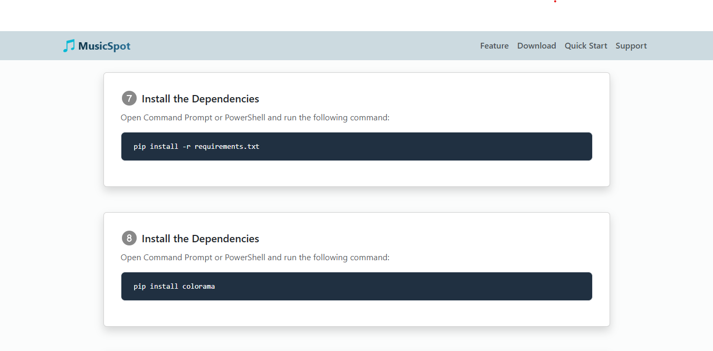

## 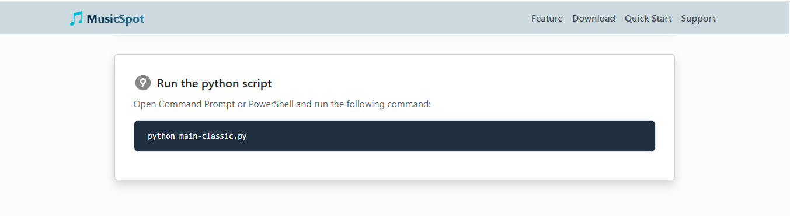

## 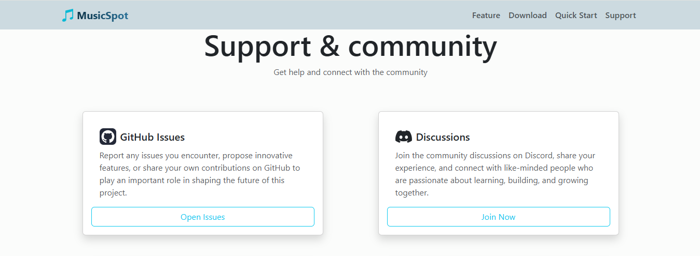

## 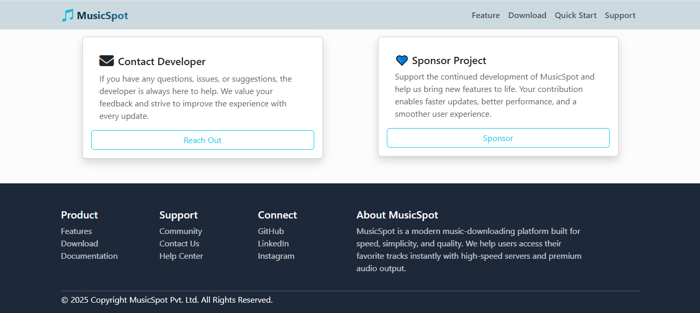

**Mobile View**

## 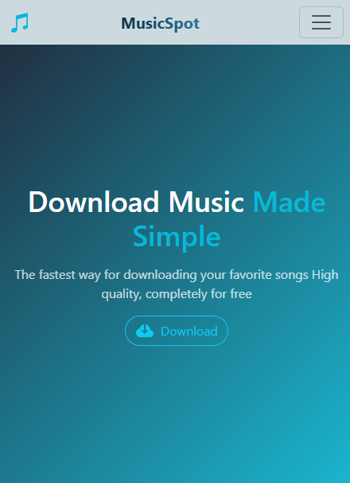

## 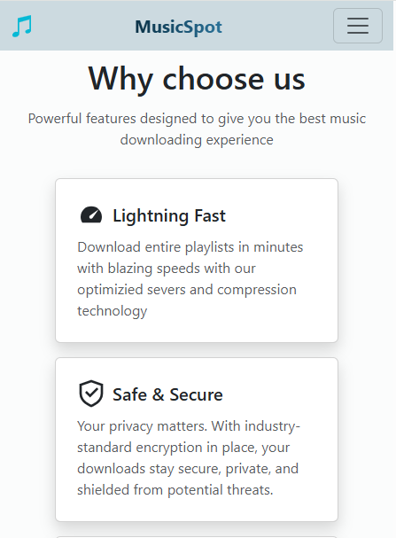

## 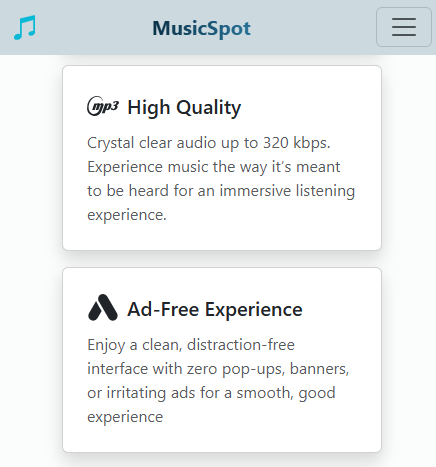

## 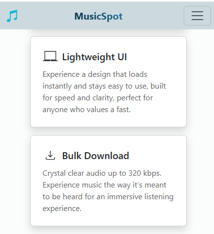

## 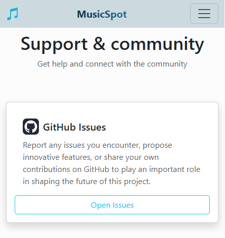

## 

## 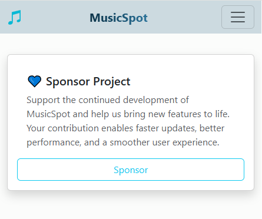

## 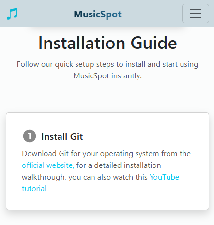

## 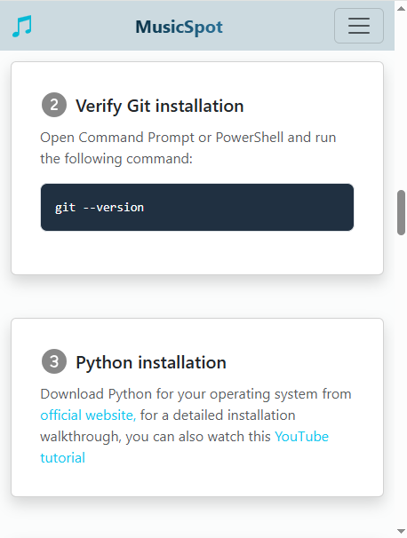

## 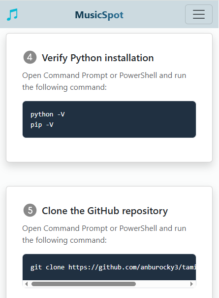

## 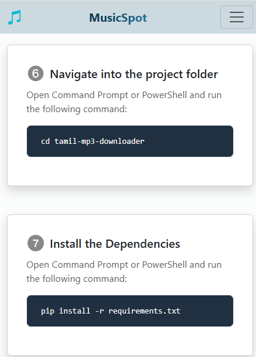

## 

## 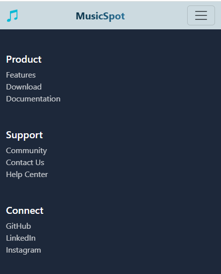

## 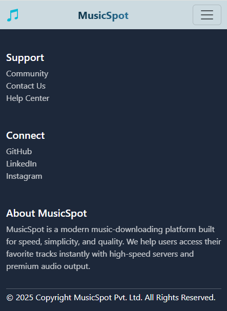

## Future Enhancements

- **Add JavaScript for enhanced interactivity**
- **Implement dark mode toggle**

---

## Author

- **Devaprabhu p**
- Email: [devap677@gmail.com](mailto:devap677@gmail.com)
- GitHub: [github.com/deva-p-stack](https://github.com/deva-p-stack)

---

## Acknowledgement:

Special thanks to [Anbuselvan Rocky](https://github.com/anburocky3) for his valuable mentorship.

---

## References

[W3Schools HTML, CSS, Bootstrap Tutorials](https://www.w3schools.com)
