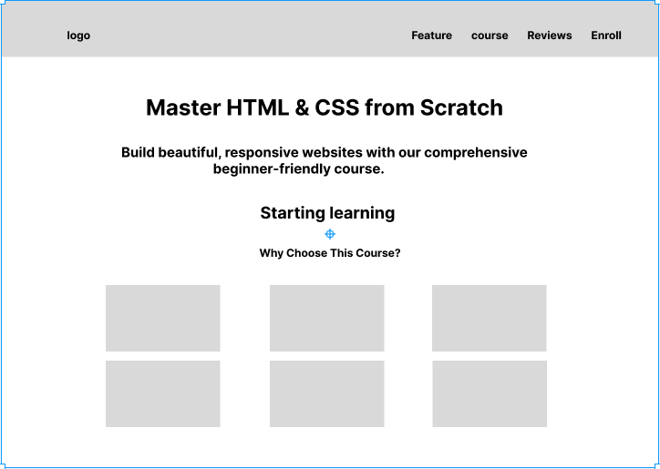

## HTML & CSS Course Landing Page
A modern, responsive landing page for an HTML & CSS course built with pure HTML and CSS. Features a clean design, smooth animations, and mobile-first approach.

---

## Features
- Responsive Design: mobile and tablet devices
- Mobile Navigation: Hamburger menu for mobile devices

---

## Wireframes

---

## Color Palette
- **Primary Gradient:** #667eea, #764ba2
- **Text:** #333

---

## Technologies Used
- **HTML5:** Semantic markup
- **CSS3:** Flexbox, Grid, Animations, Media Queries
- **Font Awesome:** Social media icons
- **Google Fonts:** Segoe UI font family

---

## Future Enhancements
- Add JavaScript for enhanced interactivity
- Implement dark mode toggle

---

### Live link:

[View Live Project](https://deva-p-stack.github.io/cyberdude-task/index.html)

---

## Author
- **Devaprabhu p**
- Email:  [devap677@gmail.com](mailto:devap677@gmail.com)  
- GitHub: [github.com/deva-p-stack](https://github.com/deva-p-stack)  

---

## Acknowledgement:

Special thanks to [Anbuselvan Rocky](https://github.com/anburocky3) for his valuable mentorship.

---

## References
[W3Schools HTML & CSS Tutorials](https://www.w3schools.com)
